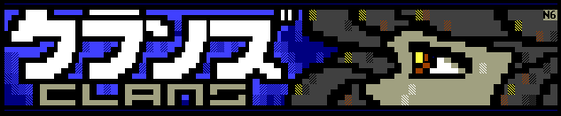
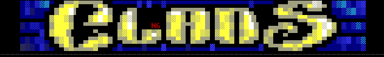

# The Clans

**A multi-player fantasy BBS door game of war, intrigue, and empire.**

Build your clan from nothing. Recruit warriors, rogues, and spellcasters.
Train them. Arm them. Then unleash them on the world.

Fight rival clans for dominance of your village. Seize the throne and set
the tax rates. Raise an army and march on neighboring villages -- villages
run by real players on other BBSes across an InterBBS network. Spy on your
enemies. Forge alliances. Betray them when the time is right.

Every village is a real BBS. Every rival clan is a real player. Travel
between villages, raid their economies, topple their rulers, and claim
their land for your empire. The league never sleeps -- while you're offline,
other players are scheming, building, and preparing to strike.

- **Deep RPG mechanics** -- classes, spells, items, quests, and NPC encounters
- **Strategic warfare** -- raise armies, set battle formations, launch sieges
- **InterBBS multiplayer** -- travel between BBSes, fight real players across a network of villages
- **Empire building** -- conquer villages, control economies, rule the league
- **Extensible content** -- sysops and creators can build custom quest packs, monsters, items, and spells

Free and open source (GPL v2). Runs on FreeBSD, Linux, and Windows.

## Documentation

The Clans has four tiers of documentation, each building on the previous:

| Audience | Description | Documentation |
|----------|-------------|---------------|
| **Player** | Learn the game -- commands, combat, classes, empires, quests, and world travel | [player.txt](release/player.txt) |
| **Sysop** | Install the game, run it on your BBS, join InterBBS leagues, install quest packs | [clans.txt](release/clans.txt) |
| **PAK Developer** | Use the devkit to create custom items, monsters, spells, events, and quest packs for distribution | [clandev.txt](devkit/clandev.txt) |
| **Source Developer** | Modify the C source code for the game itself | [notes.txt](docs/notes.txt) |

Each audience is expected to be familiar with the documentation for all prior tiers.

