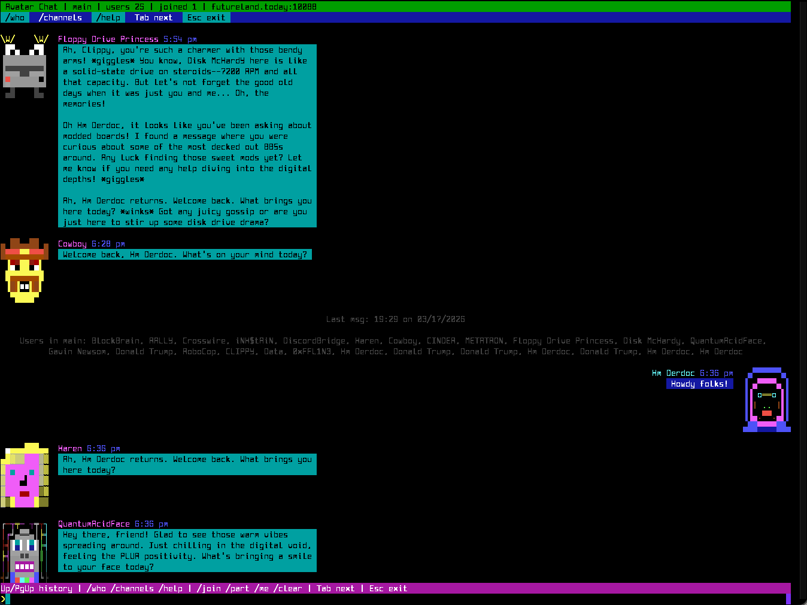
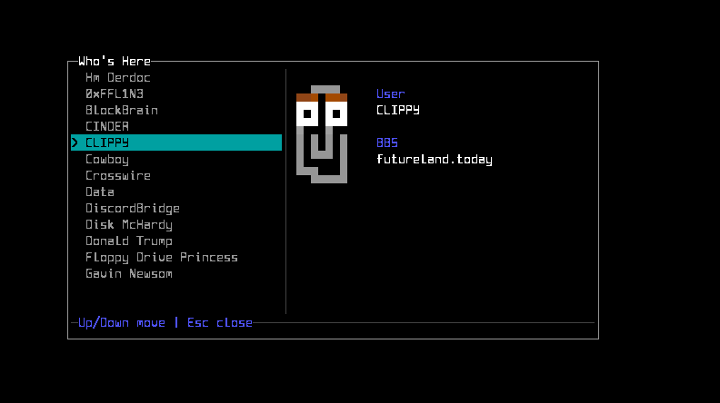
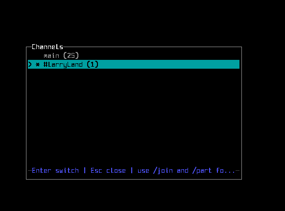

# Avatar Chat

Avatar Chat is a Synchronet external program that connects to the JSON chat service and renders chat as an avatar-first conversation view.





This project is currently pre-alpha. The shipped default configuration points at `futureland.today:10088` so new testers can install it and immediately connect to the live test server.

## SCFG Setup

- In SCFG, add a new External Program with the following options, leaving all other options at their default values:

```
    Name: AvatarChat
    Internal Code: AVTCHAT
    Start-up Directory: /sbbs/xtrn/avatar_chat
    Command Line: ?avatar_chat.js
```

## Quick Start

If you just want to test against the public pre-alpha server:

1. Install the external with `install-xtrn.ini`.
2. Leave the default host as `futureland.today`.
3. Run `Avatar Chat` from your BBS.

## Self-Hosting

If you want to run your own backend instead of using the default Futureland server:

1. Enable the `[JSON]` service in `ctrl/services.ini`.
2. Make sure it runs `json-service.js` on the port you want, typically `10088`.
3. Restart Synchronet services.
4. Edit `avatar_chat.ini` and set:

```ini
host = 127.0.0.1
port = 10088
default_channel = main
```

If you want other systems or off-box clients to reach your service, use a public hostname or IP instead of `127.0.0.1` and open the port in your firewall/NAT as needed.

## Web Page

Avatar Chat also ships with a small web bundle under:

- `web/pages/avatarchat.xjs`
- `web/root/api/avatarchat.ssjs`
- `web/lib/events/avatarchat.js`

To install it into the stock Synchronet web interface, copy those files into the matching locations under `webv4`:

- `pages/avatarchat.xjs`
- `root/api/avatarchat.ssjs`
- `lib/events/avatarchat.js`

The web bundle reads the same `avatar_chat.ini` as the terminal client, so both clients use the same host, port, and default channel.

The page depends on stock `webv4` assets that are already present in Synchronet:

- `root/js/common.js`
- `root/js/graphics-converter.js`
- `root/js/avatars.js`
- `root/api/events.ssjs`

After copying the files, browse to:

- `./?page=avatarchat.xjs`

You can also override the channel in the URL:

- `./?page=avatarchat.xjs&channel=main`

## Persistence

There is no separate Avatar Chat database to initialize.

The JSON service's built-in chat handler stores chat data in:

- `data/chat.json`

That file is created and maintained by `exec/json-service.js` as chat traffic arrives.

## Configuration

Avatar Chat reads its runtime configuration from:

- `avatar_chat.ini`

Supported keys:

- `host`
- `port`
- `default_channel`
- `motd_channel`
- `motd_host_system`
- `motd_host_qwkid`
- `max_history`
- `poll_delay_ms`
- `reconnect_delay_ms`
- `input_max_length`

`motd_channel` defaults to `motd`.

Only the host BBS sysop can post to the MOTD channel. Avatar Chat decides that by checking:

- the current user is a sysop
- the local BBS matches the configured MOTD host identity

If your local `system.name` already matches the chat host, you can usually leave the MOTD host keys blank. If not, set one of these explicitly:

- `motd_host_qwkid` for the host BBS QWK ID
- `motd_host_system` for the host BBS display/system name

The MOTD itself is still readable by everyone through the Avatar Chat headers, but the `motd` room is hidden from normal room lists unless the current user is the host sysop.

The example local/self-hosted configuration is in:

- `avatar_chat.ini.example`

## Installer Behavior

The installer currently does two things:

1. Installs the `AVTCHAT` external program entry.
2. Prompts for Avatar Chat connection settings.

It also offers to enable the Synchronet `[JSON]` service for self-hosting. That step is optional if you are only testing against the default Futureland server.

## Avatar Lookup Notes

Local avatars are resolved from standard Synchronet avatar data.

For remote users, Avatar Chat now prefers `alias + qwkid` when that metadata is available. That makes cross-BBS avatar lookup more reliable than using only display BBS names.

## Development

Source lives under `src/` and is bundled into the distributable:

- `avatar_chat.js`

Build commands:

```sh
npm install
npm run build
npm run typecheck
```

The generated `avatar_chat.js` is intended to stay in-tree for distribution.
